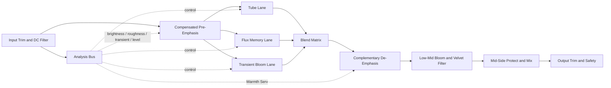
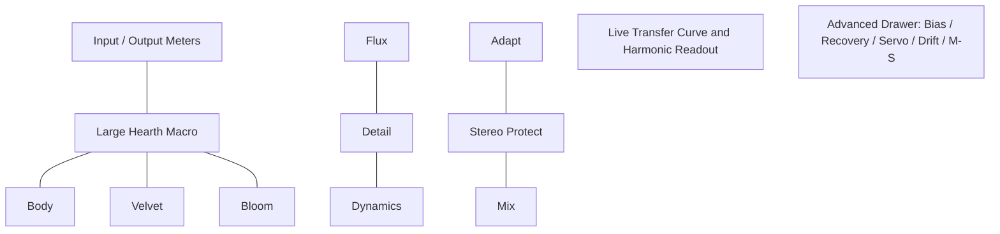

# Harmonic Saturation in Audio Plugins and a Proposal for a New Max for Live Device

## Executive Summary

The current state of the art in “warm,” harmonically rich saturation is defined by four converging ideas. First, the best commercial tools no longer treat saturation as a single transfer curve: they combine routing topologies, per-band or per-stage control, and dynamic modulation. Ableton Roar exposes single, serial, parallel, multiband, mid/side, and feedback routings; FabFilter Saturn 2 extends this further with up to six bands, 28 styles, per-band dynamics/feedback, and optional 8x/32x HQ oversampling; Goodhertz Tupe separates tube, tape, and opto behaviors and adds a compensated emphasis stage that changes what gets distorted without permanently skewing the final tonal balance. Second, specialized “warmth” plugins increasingly model distinct analog mechanisms such as tubes, transformers, and tape, rather than only providing a generic waveshaper. Third, anti-aliasing is now central, with oversampling, ADAA, and stateful anti-aliasing research all directly relevant to musical distortion. Fourth, machine-learning-based black-box and gray-box modeling is now a serious research direction, but it is not yet the most practical fit for an interpretable, low-latency, Max for Live saturation device aimed at live use. citeturn36view0turn19view2turn21view0turn19view0turn19view5turn17view3turn24view0turn24view2turn28view3turn28view4

The most important gap, relative to your brief, is that many existing tools are either too broad and easy to push into harshness, or too narrow and source-specific. Roar deliberately includes curves such as Fractal, Tri Fold, and Shards; Decapitator includes a 20 dB “Punish” gain jump; M4L community devices often split between one-knob convenience designs and niche experiments such as hysteretic saturation. Those are valuable, but they do not squarely target “beautiful, nostalgic, homey” warmth across vocals, guitars, synths, drums, and full mix with a low-risk workflow. citeturn19view2turn19view1turn22view5turn19view7turn19view8turn19view9

The proposed device in this report is **Hearth**, a live-first Max for Live saturator built around a pleasantness-constrained architecture: a low-order anti-aliased tube lane, a lightweight hysteresis-inspired “flux” memory lane, a transient-only “bloom” lane, and a dynamic compensated emphasis/de-emphasis stage. Its most distinctive idea is a **Warmth Servo** that gently steers bias, upper-band drive, and de-emphasis based on brightness and roughness proxies, so the device tends to stay warm and non-glitchy as the source changes. The design intentionally borrows the best lessons of Saturn 2, Roar, Tupe, transformer/tape modeling papers, and ADAA research, while avoiding their most obvious costs for live performance. citeturn21view0turn19view2turn26view1turn23view2turn24view2turn34view2turn34view0

## Current State of the Art

A practical definition of “current best practice” for warm saturation is: **control the spectrum around the nonlinearity, preserve musical dynamics, and suppress aliasing enough that the added harmonics read as density rather than digital debris**. That pattern is visible across leading products. Ableton’s Roar is explicitly a dynamic saturation effect with multiple routings, 12 shaper types, per-stage filters, a feedback section, and a compressor in the feedback loop. Saturn 2 adds multiband processing up to six bands, 28 distortion styles, per-band drive/mix/feedback/dynamics/tone, modulation, and optional HQ oversampling modes. Tupe goes further in the “vintage tone as signal path” direction by splitting tube, tape, and opto functions and including an advanced Emphasis section that changes the signal being driven into the nonlinear stages while automatically compensating the overall response. citeturn36view0turn19view1turn19view2turn19view3turn21view0turn20view2turn20view3turn19view0turn26view0turn26view1

On the DSP research side, the field has moved well beyond naïve sample-rate waveshaping. Parker, Zavalishin, and Le Bivic showed that nonlinear waveshaping aliases because generated harmonics exceed Nyquist, and proposed continuous-time convolution as a way to suppress aliasing, especially when combined with low-order oversampling. Holters and Parker later extended antiderivative-based methods to a class of **stateful** systems, which matters because some musically important nonlinearities have memory. Gabrielli and Squartini’s 2025 work makes an especially practical contribution for implementers: ADAA with numerically integrated lookup tables removes the need for closed-form antiderivatives in many industrial contexts. In parallel, tube and tape modeling have become materially more efficient: Giampiccolo and colleagues proposed a quadric-surface tube model with a reported 4.6× speedup relative to a more traditional triode model, while Chowdhury’s physical tape model used a hysteresis process plus 16x oversampling because the bias signal and the hysteretic nonlinearity otherwise create serious aliasing pressure. citeturn17view3turn24view0turn24view2turn24view3turn25view1turn23view1turn23view2

A further trend is the rise of differentiable black-box and gray-box modeling. Comunità, Steinmetz, and Reiss characterize this as an attempt to compare architectures across many nonlinear effects rather than on only one device family, and they show that real-time viability depends not just on accuracy but on receptive field, frame size, latency, and implementation environment. That is important context: neural approaches are undeniably part of the state of the art, but the literature itself also emphasizes practical deployment constraints. For a live Max for Live device where transparent parameter mapping, predictable CPU use, and modulate-able internal structure matter, a carefully designed gray-box / white-box hybrid remains the more robust choice. citeturn28view3turn28view1turn28view5

The Max for Live ecosystem is active, but the warm-saturation segment is still fragmented. Community devices include focused convenience tools such as OneKnob Tape, more featured hybrid designs such as Saturator Pro, and experimental magnetic-style devices such as Hysteresis. That is encouraging, but it also suggests white space: there is not yet a clearly established M4L device that combines **pleasantness-first tone design, anti-aliased nonlinear DSP, cross-source consistency, dynamic adaptation, and live-safe CPU behavior** in one coherent instrument-grade audio effect. citeturn9search3turn19view7turn19view8turn19view9

### Comparison of Existing Plugins and Devices

| Device | What it does well | Limitation relative to your brief | Why the proposed design differs |
|---|---|---|---|
| **Ableton Roar** citeturn36view0turn19view2turn19view1 | Rich routing model, per-stage filters, feedback compressor, wide shaper palette. | Excellent range, but also intentionally includes overtly harsh/exotic behaviors such as Digital Clip, Fractal, Tri Fold, Shards, and feedback-heavy tones. | Hearth keeps routing ideas, but constrains the design toward warmth-first outcomes and actively suppresses roughness build-up. |
| **Ableton Saturator** citeturn27view1turn27view2turn27view3turn27view5 | Proven basic architecture: fixed curves, color filtering, DC filtering, optional HQ mode. | Useful and fast, but less source-adaptive and less nuanced than modern multi-stage designs. | Hearth treats compensated pre/de-emphasis, dynamic bias, and path-dependent memory as first-class controls, not add-ons. |
| **FabFilter Saturn 2** citeturn21view0turn20view2turn20view3turn20view4turn20view5 | 28 styles, up to 6 bands, huge modulation, optional linear phase, 8x/32x HQ modes, transient-sensitive modulation. | Extremely powerful, but broad enough that “beautiful and homey” is only one region of a much larger search space. | Hearth narrows the search space and uses an internal Warmth Servo so the “good zone” is much easier to stay inside. |
| **Soundtoys Decapitator** citeturn22view0turn22view2turn22view3turn22view4turn22view5 | Responsive hardware-derived models, pre/post spectral shaping, strong analog attitude. | The design is intentionally comfortable moving into severe drive; “Punish” adds 20 dB. | Hearth borrows the idea of pre/post tone placement, but removes the temptation cliff into harshness. |
| **Goodhertz Tupe** citeturn19view0turn26view0turn26view1 | Strong analog signal-path concept; compensated Emphasis is musically important; optional HQ mode prioritizes quality. | Deep, but more of a studio channel-strip flavor processor than a live-first “always safe” saturator. | Hearth is simpler to play in performance, while preserving compensated emphasis as a central idea. |
| **Kazrog True Iron** citeturn19view5turn19view6 | Subtle transformer warmth, six transformer models, up to 32x oversampling, notably CPU-friendly. | Excellent at transformer color, but narrower in behavior than a full tube/tape/flux hybrid saturator. | Hearth includes a transformer-like memory lane, but does not stop at transformer behavior. |
| **CHOW Tape Model** citeturn23view0turn23view1turn23view2turn15search20 | Serious physical modeling of tape hysteresis and bias behavior; open-source, academically grounded. | Physically faithful tape is powerful, but 16x oversampling and full bias/hysteresis detail are costlier than many live users need. | Hearth uses a deliberately lighter hysteresis-inspired memory block to capture the vibe at lower computational cost. |
| **Hysteresis for Max for Live** citeturn19view7 | Rare M4L example explicitly targeting magnetic-flux-style saturation loops rather than static waveshaping. | Niche and specialized; not obviously framed as an all-purpose, live-safe warmth processor. | Hearth keeps the path-dependent idea but integrates it with anti-aliased low-order saturation, transient bloom, and source adaptation. |

The comparison strongly suggests that the best new M4L opportunity is **not** “another generic clipper,” “another tape emulator,” or “a clone of Roar/Saturn.” The opportunity is a **pleasantness-constrained hybrid saturator** that sounds “finished” quickly, stays low-risk on many sources, and exposes only the parts of advanced DSP that improve musical results. citeturn36view0turn21view0turn19view0turn19view6turn19view7

## Design Targets and Assumptions

Your brief implies a more specific engineering target than “analog-style saturation.” In psychoacoustic terms, the device should create **density without roughness**, add harmonic richness without spectral glare, and gently reduce crest-factor sharpness without audibly flattening expression. That interpretation is consistent with three useful source-backed cues. Brightness is strongly tied to spectral centroid; roughness in the 20–300 Hz amplitude-modulation region is inversely related to pleasantness; and many “warmth” tools explicitly trade between 2nd-order “valve-like” and 3rd-order “transistor-like” distortion, or use tube/tape/transformer mechanisms to round transients and add body. citeturn38view1turn39view2turn38view3turn35view0turn35view2turn34view0

From that, the proposed design targets are clear. It should favor low-order harmonics, keep upper-mid / high-band distortion self-limiting, preserve the center image on full mixes, and use dynamic controls that mostly move on sub-audio or envelope timescales rather than in obvious audio-rate “FX” ways. It should also avoid linear-phase or long-latency design choices in its default live mode, even though products such as Saturn 2 correctly use linear phase and aggressive oversampling for mastering-oriented workflows. That is an inference from the cited products: mastering tolerance for latency is not the same as live-performance tolerance for latency. citeturn20view3turn21view0turn36view0

The proposal below assumes a **stereo audio effect** intended for Ableton Live 12 / contemporary Max for Live usage, with no hard platform limits beyond a modern laptop. It also assumes that the first release should prioritize **predictable feel, low-to-moderate CPU, and interpretable controls** over exact clone-level physical emulation or machine-learned capture. Those are design assumptions, not claims about the market.

## Proposed DSP Architecture

I propose a device called **Hearth**. The guiding metaphor is not “heat until it breaks,” but **heat until the sound feels inhabited**. The device therefore uses three cooperating lanes, all fed by a compensated spectral-conditioning stage and all supervised by lightweight source analysis.

### Core nonlinear idea

The **Tube Lane** is the main harmonic engine. It is a memoryless soft-clipping stage designed to live mostly in the “Soft Sine / Tube Preamp / smooth analog” region familiar from Ableton and FabFilter, not in the hard-clip / fold / fractured region. Its transfer function should be anti-aliased using **ADAA-LUT**, because the 2025 LUT-integration work makes implementation more practical, and Chowdhury’s developer notes show that modest oversampling plus first- or second-order ADAA is a strong practical compromise for tanh-like waveshaping. citeturn24view2turn24view3turn34view2turn34view3turn19view2turn27view0

A good core shaper for live use is a normalized, branch-light S-curve with controllable asymmetry:

\[
u[n] = g \cdot x[n] + b[n]
\]

\[
y_T[n] = f_{\text{ADAA}}(u[n]) - f_{\text{ADAA}}(b[n])
\]

where \(g\) is drive and \(b[n]\) is a slowly moving dynamic bias. The bias subtraction removes most DC build-up after asymmetry. The actual \(f\) can be a tanh-family or rational soft clip; the important design choice is not the exact closed form, but that it be **ADAA-capable** and stored as a transfer table plus first and second antiderivative tables. Gabrielli and Squartini’s ADAA-LUT result is the enabling paper here, because it removes the need to derive every antiderivative by hand. citeturn24view2turn24view3

The **Flux Memory Lane** is the device’s distinctive element. It is **not** a full Jiles–Atherton magnetic model, because Chowdhury’s physically-based tape work and transformer/hysteresis research show why those models are valuable but also why they are heavier and require significant oversampling. Instead, Hearth uses a **hysteresis-inspired, path-dependent state block** with controllable loop area. The practical goal is to capture the audible benefits developers describe for transformer/tape behavior—tiny transient rounding, denser lower mids, reduced crest factor, and slight path dependence—without paying the CPU cost of a fully physical model. This is also consistent with the M4L Hysteresis device and with recent transformer-modeling discussion from Variety of Sound, both of which emphasize that the “magic” lies partly in path-dependent behavior, not only in a fixed saturation spot. citeturn23view2turn19view7turn34view0

A useful simplified formulation is:

\[
m[n] = m[n-1] + \alpha_{\text{dir}}(u[n] - m[n-1])
\]

\[
\alpha_{\text{dir}} = \alpha_r + (\alpha_a - \alpha_r)\cdot s(u[n]-u[n-1])
\]

\[
y_F[n] = f_{\text{soft}}(u[n] + h\,m[n]) - \eta\,m[n]
\]

where \(s(\cdot)\) is a smoothed sign / direction detector, \(\alpha_a\) and \(\alpha_r\) are attack and return coefficients, \(h\) is loop area, and \(\eta\) prevents the memory term from becoming too obviously resonant. The result is a **quasi-hysteretic return path**: rising and falling trajectories are not identical, so attacks and releases “lean” differently. This is not a scientific hysteresis model; it is a controlled audio abstraction of one. That distinction should be explicit in the documentation.

The **Transient Bloom Lane** is a parallel, time-local treatment that only engages strongly on attacks. Saturn 2’s transient detection mode and Roar’s modulation-oriented architecture both point toward a useful principle: let transient analysis control how much saturation is admitted, rather than only asking the user to guess. In Hearth, the transient lane slightly overdrives a band-limited copy of the attack and returns it with a short release, so the ear reads **thickness and onset softness** rather than clipped smack. citeturn20view5turn19view3

### Warmth Servo and psychoacoustic constraint layer

The proposal’s unique control layer is the **Warmth Servo**. It monitors four low-cost proxies:

- **Fast and slow level envelopes** for program dependency.
- **Brightness proxy** based on the ratio of high-band to low-/mid-band energy, because spectral centroid tracks perceived brightness well. citeturn38view1
- **Roughness proxy** based on modulation energy in a high-mid band, because AM in the roughness region is perceptually aggressive. citeturn39view2turn38view3
- **Transient density proxy** from a fast-minus-slow envelope difference.

The servo then makes only conservative corrections. If brightness or roughness climb, it gently reduces upper-band drive, narrows asymmetry, and increases complementary de-emphasis after the nonlinear lanes. If the source is dull but peaky, it allows more Bloom and a little more bias asymmetry. If the source is already dense and bright, it leans harder on the Flux lane and less on the Tube lane. This is the design’s main differentiator: many plugins give you all the dangerous degrees of freedom, but few try to keep the result inside a perceptually comforting operating region.

A second psychoacoustic trick is a **compensated Emphasis stage**, inspired by Tupe’s Emphasis filter but made dynamic. The filter before the nonlinear lanes can tilt the signal toward or away from bass / lower mids / presence, while the complementary filter after the lanes restores most of the original equilibrium. That means the user changes **where the new harmonics are created** rather than merely EQ’ing the final output. For warmth, this is far more effective than post-EQ alone. citeturn26view1

### Anti-aliasing and quality modes

Because aliasing is one of the clearest ways warmth turns into harshness, Hearth should treat anti-aliasing as a product feature, not an invisible implementation detail. The best live compromise is **selective anti-aliasing**:

- **Eco**: first-order ADAA-LUT on the Tube lane; base-rate Flux lane with built-in low-pass behavior.
- **Live**: first-order ADAA-LUT on the Tube lane plus local 2x oversampling around the asymmetric drive / bias stage and the Flux lane entrance.
- **High**: second-order ADAA-LUT on the Tube lane plus local 4x oversampling around the biased nonlinear kernel.

This approach follows the literature better than brute-force full-device oversampling. The Parker paper shows why oversampling helps but is not ideal alone; Chowdhury explicitly recommends modest oversampling in conjunction with ADAA; the 2025 LUT paper makes that combination much easier to ship; and Holters shows the stateful case is tractable, but more delicate. citeturn17view3turn34view2turn24view2turn24view0

One important design choice is to keep the default downsampling filters **minimum-phase / low-latency**, not linear-phase. Saturn 2’s linear-phase option is explicitly positioned as making multiband distortion more suitable for mastering; that is a strong hint that live-focused M4L defaults should prioritize timing feel instead. That is an inference, but an important one. citeturn20view3

## Max for Live and Gen Implementation

### Patch architecture

The top-level Max for Live device should be simple: UI, parameter mapping, preset handling, metering, and optional visualization in Max; all real audio processing in a single **gen~** core. Cycling ’74’s documentation is explicit that `gen~` turns an embedded Gen patcher into optimized native machine code, which is exactly what we want for a compact live device. If you later want a multichannel internal version for band routing experiments, `mc.gen~` exposes the same compiled approach for multichannel workflows. citeturn29view0turn29view8

Inside the Gen patcher, the structural modules should be:

1. **Input conditioning**  
   DC filter, input trim, input normalize-to-table-range.

2. **Analysis block**  
   Fast/slow envelopes, brightness proxy, roughness proxy, transient detector.

3. **Compensated emphasis block**  
   Low-cost shelves / tilts around the nonlinear core.

4. **Tube lane**  
   ADAA-LUT shaper with dynamic bias.

5. **Flux lane**  
   History-based path-dependent memory saturator.

6. **Bloom lane**  
   Transient-gated parallel softener.

7. **Blend, de-emphasis, stereo protect, output trim**

This should be implemented as Gen subpatchers or codebox functions for clarity. The Cycling ’74 material is worth taking literally here: codebox is powerful for complex expressions, but it is **not automatically faster** than graphical Gen; profile first, then optimize. Graham Wakefield’s forum guidance to “make it work, make it right, make it fast” and to measure the expensive 20% with `@cpumeasure` is exactly the right discipline for this device. citeturn29view1turn33view0turn32view1

### Recommended Gen objects and table strategy

`history` should store all one-sample feedback states: envelopes, previous input samples for ADAA, memory-lane state, and servo smoothers. Cycling ’74 documents `history` as the single-sample delay operator that makes feedback legal inside Gen, and notes that feedback operators apply denormal protection by default. That is useful for saturated feedback-like structures that can otherwise decay into denormals. citeturn29view2turn29view5

`samplerate` should be the only source of truth for coefficient calculation. All time constants should be sample-rate normalized:

\[
a = e^{-1 / (\tau \cdot f_s)}
\]

\[
y[n] = x[n] + a\,(y[n-1]-x[n])
\]

That keeps the device behavior stable at 44.1, 48, 88.2, or 96 kHz. Cycling ’74’s `samplerate` object exists for exactly this purpose. citeturn29view3

For tables, use `data` plus `lookup`. Cycling ’74 documents `data` as a 64-bit local array and `lookup` as a waveshaping-oriented interpolated table reader with the input range mapped from -1 to 1 across the table. For Hearth, I would use either one `data` object with **three channels**—\(f(x)\), \(F_1(x)\), \(F_2(x)\)—or three separate one-channel tables. A practical initial size is **4096 samples per channel** for Eco/Live and **8192** for High mode. Those sizes are not dictated by the docs; they are design recommendations informed by the ADAA-LUT literature and the need to keep interpolation error low without over-allocating memory. citeturn29view4turn30search0turn24view2turn24view3

### Oversampling placement

Do **not** oversample the entire Gen patch unless profiling proves it is cheap enough. Instead, isolate oversampling around the parts most likely to spray alias content: the biased soft clipper and, in High mode, the entrance to the Flux lane. This is the most important CPU-saving decision in the whole design. It reflects both the research literature and common developer practice: oversampling cost rises quickly, while ADAA and state-aware techniques let you spend that budget more selectively. citeturn17view3turn24view0turn24view2turn34view2

### Buffer sizes, vectors, and scheduling

During development, test the device at multiple signal vector sizes because Max processes audio in blocks, and vector size changes both timing behavior and CPU behavior. Cycling ’74 recommends understanding the interaction among sampling rate, I/O vector size, signal vector size, Overdrive, and Scheduler in Audio Interrupt; they also note that sample-accurate scheduling requires Overdrive and Scheduler in Audio Interrupt. For UI-linked modulation, prefer internal signal-domain smoothing rather than spamming the scheduler. citeturn29view6turn29view7turn32view0

A good internal rule set is:

- Smooth every exposed parameter at signal rate with separate attack/release constants.
- Update visualization no faster than about 20–30 Hz on the Max side.
- Use `change`, `deferlow`, `speedlim`, and bundled list messages outside the DSP core to reduce scheduler traffic, as recommended in the Cycling ’74 community discussions.
- Measure CPU with `gen~ @cpumeasure 1` while testing parameter sweeps and worst-case presets. citeturn32view0turn32view1turn33view0

### UI controls and UX rationale

The UI should make **warmth** the default outcome and push destructive behavior behind an advanced drawer. The main panel should therefore expose only controls that users will reach for on almost every source.

| Control | Range | Default | Why it exists |
|---|---:|---:|---|
| **Hearth** | 0–100 % | 35 % | Main macro. Simultaneously increases drive, compensated emphasis depth, and mild sag while keeping the servo engaged. |
| **Body** | -6 to +6 dB | +1.5 dB | Low-mid emphasis target, mostly 140–700 Hz. Helps “homey” fullness without muddying via a simple bass boost. |
| **Velvet** | 0–100 % | 28 % | Upper-band softening / de-emphasis intensity. Higher values reduce glare and keep vocals/guitars polite. |
| **Bloom** | 0–100 % | 24 % | Transient-only parallel thickness. Makes attacks feel rounded and “record-like.” |
| **Flux** | 0–100 % | 18 % | Amount of path-dependent memory behavior from the hysteresis-inspired lane. |
| **Bias** | -25 to +25 % | +4 % | Static asymmetry trim. Small positive default encourages gentle even-order enrichment. |
| **Adapt** | 0–100 % | 62 % | Warmth Servo authority. At 0, the device becomes more static; at high values, it actively resists harshness and adjusts by source. |
| **Detail** | 0–100 % | 58 % | Dry-presence reinjection after the main saturator. Prevents “warm” from becoming dull. |
| **Dynamics** | 0–100 % | 42 % | Program-dependent sag / relaxation amount. Higher values produce more level-sensitive warmth. |
| **Recovery** | 20–600 ms | 140 ms | Time constant for the dynamic relaxation and memory return. |
| **Stereo Protect** | 0–100 % | 70 % | Reduces center-image damage by limiting side-only overdrive and preserving mono compatibility. |
| **Mix** | 0–100 % | 100 % | Parallel blend; essential for drums and buses. |
| **Output** | -24 to +24 dB | 0 dB | Final level trim after internal autogain compensation. |
| **Quality** | Eco / Live / High | Live | Anti-aliasing and local oversampling policy. |
| **Auto Trim** | Off / On | On | Matches level after Hearth changes so users do not confuse louder with better. |
| **Advanced Aesthetic Noise** | 0–10 % | 0 % | Optional extremely low-level “patina” for nostalgic contexts; off by default to keep bus use safe. |

The advanced drawer can expose **Flux Attack**, **Flux Return**, **Servo Brightness Threshold**, **Servo Roughness Threshold**, **Mid/Side Drive Skew**, and **Drift Depth**. Those are useful for expert sound design, but they should not clutter the main interface.

### Interface layout and interaction model

The visual identity should feel more like a **quiet hi-fi object** than a lab instrument or guitar pedal. Dark charcoal background, warm amber / cream highlights, soft meters, restrained motion. The center should be dominated by one macro control and one live transfer display, because that keeps the device legible from a distance in performance.

A useful interaction model is:

- **Single-click / drag** for broad moves.
- **Shift-drag** for fine moves.
- **Double-click** to reset to default.
- **Macro-first workflow**: Hearth alone should get the user 70% of the way there.
- **Visualization-first safety**: the transfer curve should subtly show when the roughness guard or brightness compensation is stepping in.

That interaction philosophy is not copied from any single product, but it is aligned with why Saturn 2’s modulation visualization and Roar’s stage-oriented presentation are effective: they lower search friction. citeturn21view0turn19view3

## Validation, Evaluation, and Open Questions

### Test cases and audio examples to try

The device should be tested on a small, fixed corpus covering the intended use cases:

- **Vocal**: intimate, sibilant lead with breaths and held notes.  
  Listen for increased body, stable intelligibility, and no spitty top-end.

- **Guitar**: clean DI with picked transients and open chords.  
  Listen for transient rounding and harmonic fullness without fizz.

- **Synth**: bright saw pad and mono bass.  
  Listen for density, stereo safety, and whether the Warmth Servo appropriately restrains upper-band splash.

- **Drums**: close snare, full drum bus, and loop with hats.  
  Listen for attack “sit,” weight, and controlled cymbal harshness.

- **Full mix**: modern bright mix and darker vintage-styled mix.  
  Listen for whether the device improves cohesion without collapsing contrast.

Those examples are design recommendations, but the evaluation methods should borrow from the literature.

### Objective evaluation criteria

For objective checks, I recommend five plots and one profiling table.

The first is a **swept-sine spectrogram** in the style used in the ADAA-LUT paper. The second is a **single-tone FFT alias plot** at a high musical pitch, again following the DAFx25 practice of showing mirrored alias components. The third is a **transfer-curve family plot** at several drive settings. The fourth is a **hysteresis-loop-style input/state plot** for the Flux lane, because the CHOW tape paper explicitly compares hysteresis loops and because the point of the Flux lane is its path dependence. The fifth is a **spectral-centroid / crest-factor drift plot**, because brightness tracks centroid and transformer/tape designs often trade slightly lower crest factor for a denser, more polished sound. The profiling table should report CPU cost per instance in Eco/Live/High using `gen~` CPU measurement. citeturn24view3turn23view2turn23view5turn38view1turn34view0turn33view0

The practical pass/fail targets I would use are:

- **No obvious alias whistle** on a 997 Hz sine driven hard in Live mode.
- **Minimal DC offset** under heavy asymmetry.
- **Spectral-centroid shift** that trends downward or remains neutral on already-bright sources, unless Detail is intentionally raised.
- **Crest-factor reduction** that is audible but not severe on vocals and mix bus.
- **Live-mode CPU** low enough to run multiple instances in a session without special planning.
- **Center-image integrity** maintained when inserted on stereo material, with no alarming mono collapse.

### Subjective evaluation criteria

For listening tests, the right pattern is a **small expert panel with a MUSHRA-like protocol**, not casual A/B guessing. The recent nonlinear-effects modeling literature explicitly used MUSHRA and emphasized strict participant screening to reduce variance. For Hearth, that means level-match every comparison, include at least one intentionally harsher competitor preset, and ask listeners to rate not just “preference,” but **warmth, beauty, intelligibility, fatigue, and source versatility**. citeturn28view5

The subjective questions I would use are:

1. Does the processed signal feel more *inhabited* or *record-like*?
2. Is the top end softer without sounding veiled?
3. Are the harmonics readable as tone color rather than obvious distortion?
4. Does the device remain flattering across at least four very different source types?
5. Can the user find a good result quickly from the default state?

### Open questions and limitations

Some uncertainties remain, and they are worth stating plainly.

A full physically based hysteresis or tube model is not the right first implementation for a live-first M4L effect, but the exact sweet spot between **scientific fidelity** and **musical abstraction** will only become clear after profiling and listening. The literature shows both why detailed models are attractive and why they are costly. citeturn23view2turn25view1

The best pure-Gen strategy for local 2x/4x oversampling around only selected nonlinear kernels needs careful prototyping. The design direction is clear, but the exact filter topology and table size should be validated empirically in Max on real hardware.

Finally, some proprietary plugins disclose product behavior but not full internal DSP details. This report therefore prioritizes their documented features and combines those with primary DSP papers and Max documentation. Where I infer design implications—especially around latency trade-offs and live suitability—I have treated them as engineering conclusions, not revealed vendor internals.